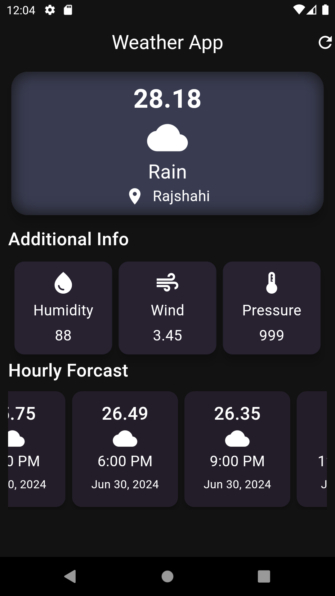
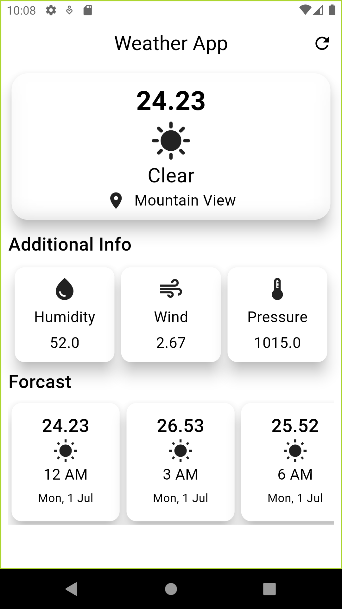

# Weather App

Recently I learned Flutter Basic Ui Widget. So I Have an intention making a weather app that fetching data from weather api by user geographic Location .

Here I used these Package:

- flutter sdk
- weather
- flutter_dotenv
- intl
- geolocator
- flutter_launcher_icon

